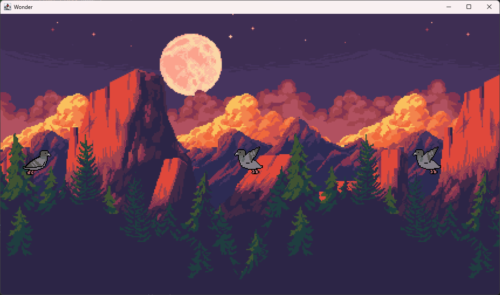

# Wonder Game



A 2D side-scrolling game where you control a pigeon dodging obstacles, built with Java and Gradle.

## Features

- Smooth pigeon animation with sprite sheets
- Parallax background with multiple layers
- Randomly generated obstacles
- AI-controlled gameplay (auto-jumping)
- Start screen with menu
- Consistent 60 FPS game loop

## Prerequisites

- Java JDK 17 or later
- Gradle 7.0 or later

## Building and Running

### 1. Clone the repository
```bash
https://github.com/d11m08y03/Game.git
cd pigeon-adventure
```

### 2. Run the game
```bash
./gradlew run
```

## Project Structure
- `src/`
    - `main/`
        - `java/game/`
            - `engine/` - Game loop and rendering (GamePanel, ParallaxBackground)
            - `model/` - Game objects (Player, Obstacle)
            - `ai/` - AI controller logic
            - `utils/` - Constants and helpers
        - `resources/` - Asset files (images, fonts)
    - `test/` - Unit tests

## Configuration
Edit `Constants.java` to modify:
- Game window size
- Physics parameters
- Rendering settings

## Assets
Required files are in `src/main/resources/`:
- Background layers in `parallax/`
- Bird spritesheet in `pigeon_fiy-Sheet.png`

## Attributions
- Backgound layers assets: https://ansimuz.itch.io/mountain-dusk-parallax-background
- Bird Spritesheet: https://kangjung.itch.io/pigeon-pixel